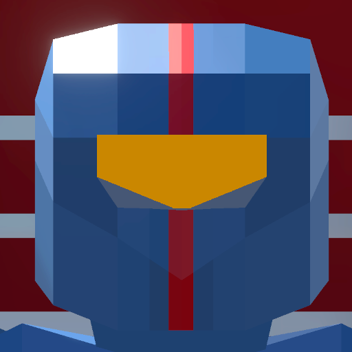

## Hi there 👋

<!--
**Tomki2258/Tomki2258** is a ✨ _special_ ✨ repository because its `README.md` (this file) appears on your GitHub profile.

Here are some ideas to get you started:

- 🔭 I’m currently working on ...
- 🌱 I’m currently learning ...
- 👯 I’m looking to collaborate on ...
- 🤔 I’m looking for help with ...
- 💬 Ask me about ...
- 📫 How to reach me: ...
- 😄 Pronouns: ...
- ⚡ Fun fact: ...
-->

# My Projects

## `ROBO DEMOLITION`

<table>
  <tr>
    <td>
      
<b>ROBO DEMOLITION</b> is a small Unity3D mobile game inspired by games like <i>Vampire Survivors</i> and <i>Survivor io</i>.

      
The player's task is to survive in the city fighting many different enemies with different behaviors. The player can also unlock new weapons and develop several character skills, which makes each game unique in its own way.

      
<a href="https://github.com/Tomki2258/Robo-Demolition">Link do game source code</a>

    </td>
    <td>
      
    </td>
  </tr>
</table>
