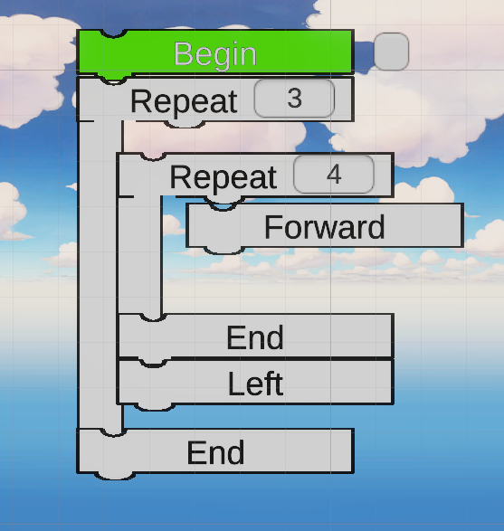
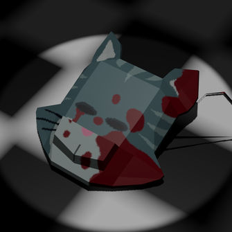
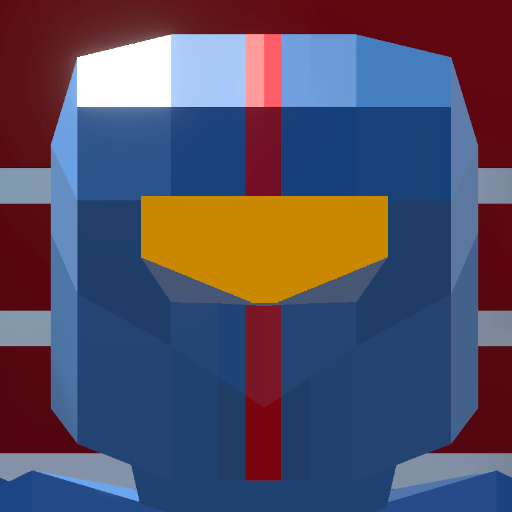

# Hi there, I'm Tomek (tamus) 👋

I am a passionate Software & Game Developer. I enjoy writing clean code, refactoring, and solving technical challenges in development.

📫 **How to reach me:** [tamusdev@gmail.com](mailto:tamusdev@gmail.com)  
🎮 **Google Play:** [Check my developer profile](https://play.google.com/store/apps/developer?id=Tomkii)

---

## 🛠️ My Projects

### 🧠 LOGIC WORLD (University Finals Project)

An educational puzzle game developed as a university finals project. The player's objective is to complete levels by constructing programs using a visual programming interface.

* **Technical Highlights:**
  * **Event-Driven Architecture:** Implemented to decouple game systems and ensure clean communication between the UI, code interpreter, and game world.
  * **Multi-Scene Architecture:** Utilized to enforce *Separation of Concerns*, making the project highly scalable and streamlining the pipeline for adding new levels.
  * **Performance Optimization:** Maximized framerates through optimized lighting, mesh LODs, and efficient draw-call batching.
  * **Software Design Patterns:** Adhered to industry best practices by implementing key design patterns:
    * **Interpreter:** To parse, validate, and execute the player's visual code setup.
    * **Command:** To manage and execute game actions sequentially.
    * **Observer:** To handle decoupled, state-driven gameplay events.
* **Core Features:**
  * **Visual Programming Engine:** Block-based programming interface designed for intuitive learning.
  * **Educational Gameplay:** Teaches core programming concepts through actions (`Move Forward`, `Move Backward`, `Turn Left`, `Turn Right`) and control flow (`Repeat [X]` loops, `If` obstacle-detection conditionals).
* **Technologies:** Unity 3D, C#, Design Patterns, Git, ScriptableObjects, Unity Event System.
* **Links:** 📁 [Source Code](https://github.com/Tomki2258/LogicWorld)

 

---

### 🎒 EQUIPMENT & INVENTORY SYSTEM
A modular, data-driven inventory and equipment system. It focuses on clean code architecture and separation of data from the UI representation.

* **Technical Highlights:**
  * Utilized **ScriptableObjects** for modular item data management, making it easy to create and configure new items.
  * Implemented an **Event-driven architecture** to sync core data structure changes seamlessly with the UI layer.
  * Implemented inventory logic supporting item stacking, splitting stacks, and strict slot constraints (e.g., preventing manual insertion into crafting output slots).
* **Technologies:** Unity 3D, C#, ScriptableObjects, Unity Event System, Git.
* **Links:** 📁 [Source Code](https://github.com/Tomki2258/EquipmentSystem)

---

### 🕵️‍♂️ UNMASKED (Global Game Jam 2026)

A detective dialogue game created in 48 hours, where players interrogate suspects and analyze clues to deduce who committed the crime.

* **My Role:** Lead Gameplay Programmer (in a 4-person team with 3 3D/2D artists).
* **Technical Highlights:**
  * Implemented a custom **ScriptableObject-based dialogue system** handling branching conversations and conditional responses.
* **Technologies:** Unity 3D, C#, ScriptableObjects, Unity Event System, Git.
* **Links:** 🕹️ [Global Game Jam website](https://globalgamejam.org/games/2026/unmasked-6-1)

---

### 🤖 ROBO DEMOLITION

A fast-paced mobile action game inspired by the bullet-heaven genre (like *Vampire Survivors*). The player fights off waves of enemies with distinct AI behaviors, unlocks weapons, and upgrades character skills.

* **Technical Highlights:**
  * Implemented modular weapon upgrade systems and persistent player progression.
* **Technologies:** Unity 3D, C#, Git.
* **Links:** 📁 [Source Code](https://github.com/Tomki2258/Robo-Demolition) | 📱 [Get it on Google Play](https://play.google.com/store/apps/details?id=com.tamus.RoboDemolition)

 

---

## 📊 GitHub Stats

  
  

